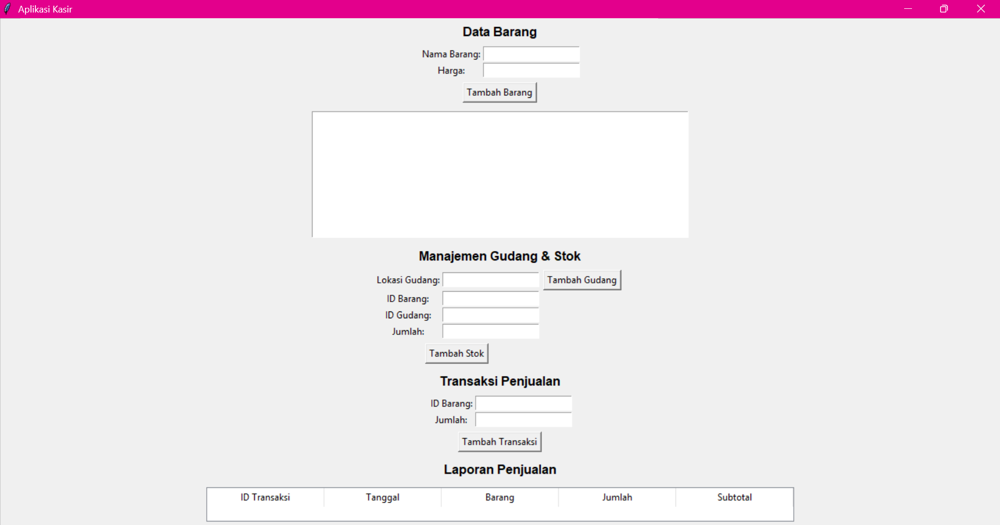

# Aplikasi Kasir Python

Aplikasi Kasir Python adalah aplikasi desktop sederhana berbasis GUI yang dibuat menggunakan Python Tkinter dan MySQL. Aplikasi ini digunakan untuk mengelola data barang, gudang, stok, transaksi penjualan, dan laporan penjualan.

Project ini dibuat sebagai latihan dasar pemrograman Python, koneksi database MySQL, dan pembuatan aplikasi kasir sederhana.

## Fitur

- Menambahkan data barang
- Menampilkan daftar barang
- Menambahkan data gudang
- Menambahkan stok barang berdasarkan gudang
- Membuat transaksi penjualan
- Menghitung subtotal transaksi otomatis
- Menampilkan laporan penjualan
- Menyimpan data ke database MySQL

## Teknologi

- Python
- Tkinter
- MySQL
- mysql-connector-python

## Struktur Project

```txt
aplikasi-kasir-python/
├── main.py
├── database.sql
├── requirements.txt
├── README.md
└── screenshots/
    └── tampilan-aplikasi.png
```

## Screenshots


